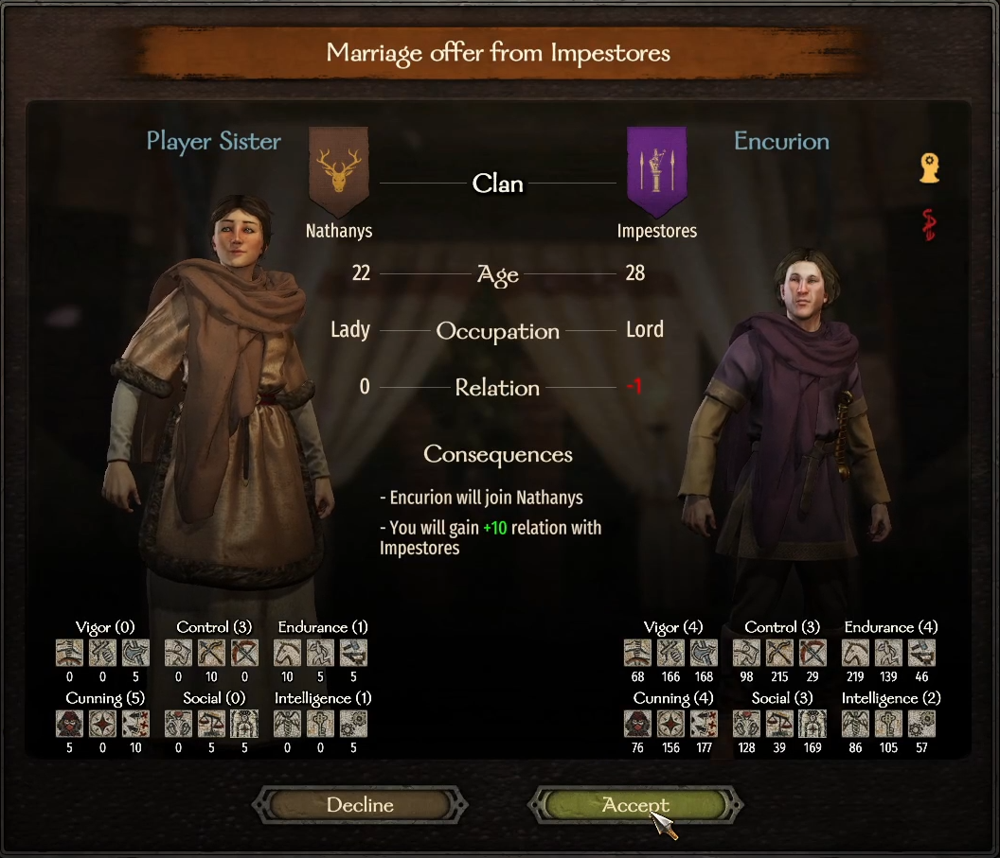
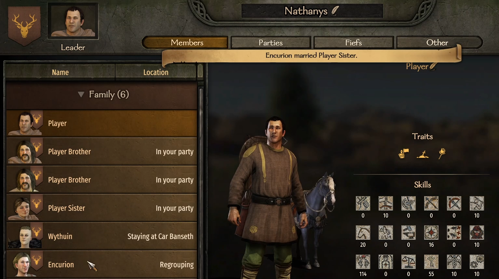
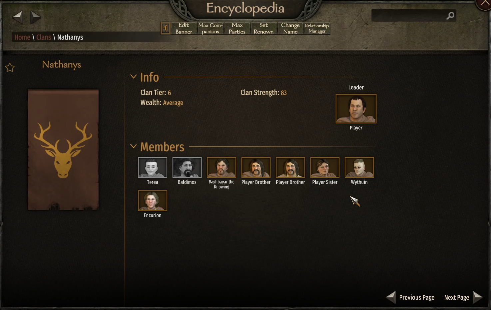
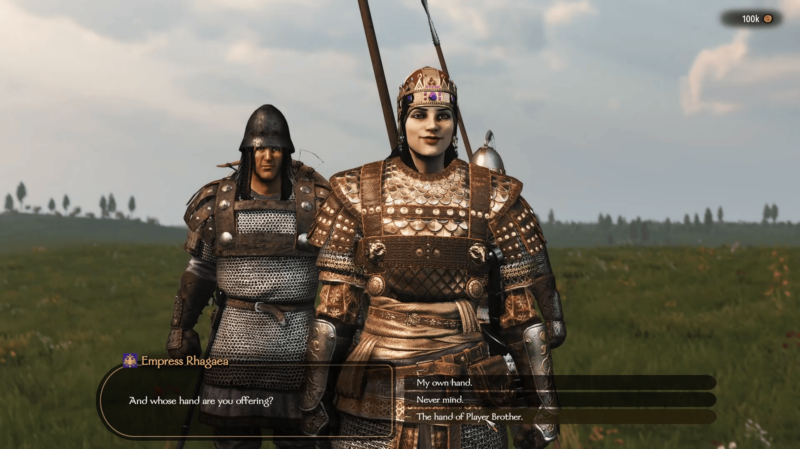
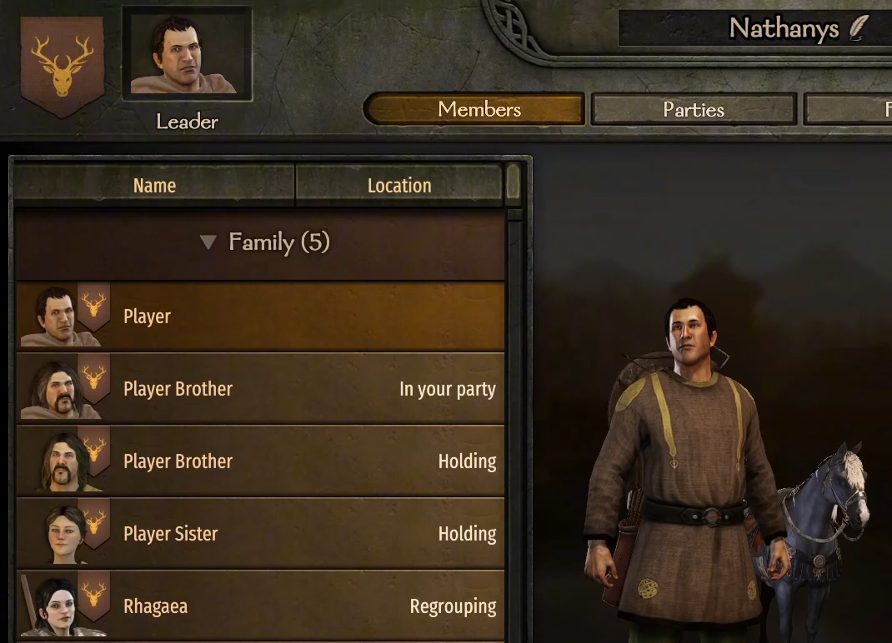
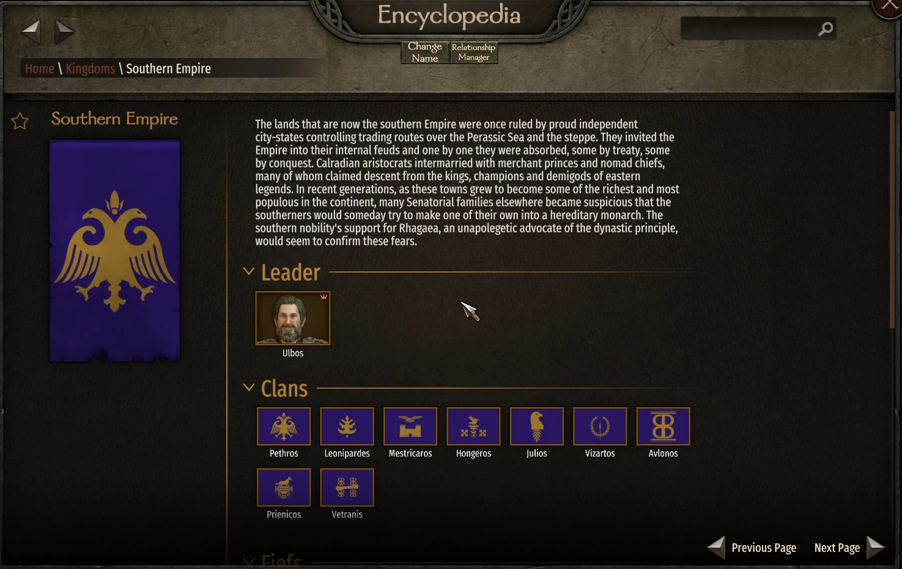
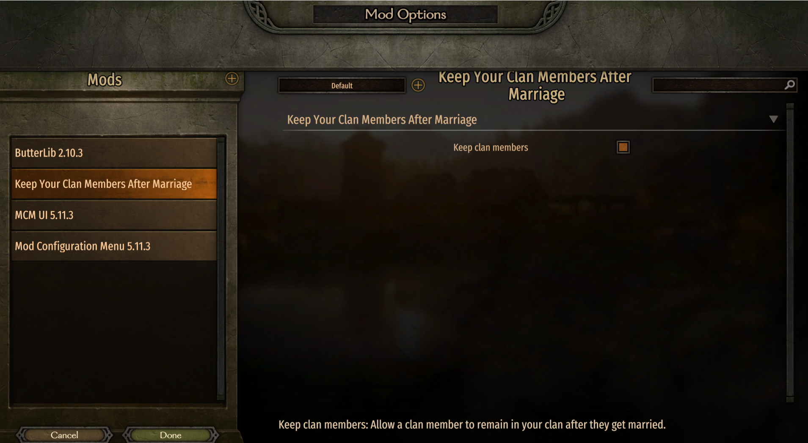

# Keep Your Clan Members After Marriage

This mod makes your clan members stay in your clan after they get married.
Both male and female clan members will remain with you, and their spouse will join your clan regardless of who they are.

## Youtube video

It can be pretty frustrating when your female clan members leave your clan after getting married. The same thing happens with male members if they marry a clan leader or a queen — they end up leaving as well.

With this mod, both your male and female clan members will stay in your clan no matter who they marry, and the spouse will join your clan instead.

If the person they marry is a kingdom ruler or a clan leader, they will still join your clan, and someone else from their original clan will take over their position.

This way, you can finally keep the clan members you’ve invested so much time into, without losing them the moment they get married.

## Screenshots

    
    
    
    
    
    
    

## Requirements

* [Mount & Blade II: Bannerlord](https://www.taleworlds.com/tr/Games/Bannerlord) >= 1.3.x version.
* [Harmony](https://www.nexusmods.com/mountandblade2bannerlord/mods/2006)
* [ButterLib](https://www.nexusmods.com/mountandblade2bannerlord/mods/2018)
* [UIExtenderEx](https://www.nexusmods.com/mountandblade2bannerlord/mods/2102)
* [Mod Configuration Menu](https://www.nexusmods.com/mountandblade2bannerlord/mods/612)

## Installation:
1. Extract archive using 7zip
2. Place in Mount & Blade II Bannerlord\Modules folder
3. Enable in launcher and organize alphabetically

**Compatibility:** Can be added/removed anytime.

**Nexus mods**: https://www.nexusmods.com/mountandblade2bannerlord/mods/9384

**Steam Workshop**: https://steamcommunity.com/sharedfiles/filedetails/?id=3620861063

## My other mods

* [No Fog Of War](https://www.nexusmods.com/mountandblade2bannerlord/mods/9355) Removes the **Fog of War** system and making all settlements and characters visible in the in-game encyclopedia.
* [Marriage Offers For Player](https://github.com/mitrax215/Bannerlord.MarriageOffersForPlayer) Allows the player to receive marriage offers just like other clan members.